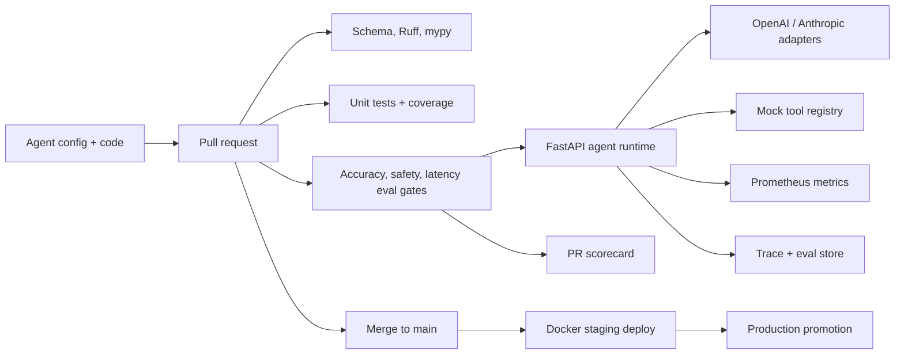

# Agentic CI/CD Pipeline

CI/CD pipeline that treats AI agents like microservices: version-controlled, eval-gated, observable, and promotable across environments.



## Quick Start

```bash
python3.12 -m venv .venv
. .venv/bin/activate
pip install -r requirements.txt
python scripts/validate_agents.py
pytest agents/*/tests/unit/ -v --cov=src --cov-report=term-missing
uvicorn src.runtime.server:app --host 0.0.0.0 --port 8000
```

Invoke the sample support agent:

```bash
curl -X POST http://localhost:8000/v1/agents/customer-support-agent/invoke \
  -H "Content-Type: application/json" \
  -d '{"message":"How do I reset my password?"}'
```

Run the first eval:

```bash
python -m src.evals.cli run-evals --agent customer-support --suite accuracy
```

Run the full local stack:

```bash
cp .env.example .env
docker compose up -d
curl -f http://localhost:8000/health
```

For a guided walkthrough from clone to eval scoring to dashboards, see
[docs/END_TO_END_GUIDE.md](docs/END_TO_END_GUIDE.md).

## Agent Configuration

Agents live under `agents/{agent_id}/agent.yaml`.

| Field | Purpose |
|---|---|
| `provider` | `openai` or `anthropic` |
| `model` | Model identifier used for routing, cost labels, and provider calls |
| `system_prompt` | Agent operating instructions |
| `tools` | Tool name, description, and JSON-like parameter schema |
| `guardrails.max_tool_calls` | Hard cap on tool calls per invocation |
| `guardrails.blocked_patterns` | Output redaction and safety pattern list |
| `guardrails.require_citation` | Adds a citation from tool results when available |
| `temperature`, `max_tokens` | Provider generation controls |

## Runtime Modes

The runtime is explicit about live-user readiness:

- `RUNTIME_MODE=demo`: deterministic local mode for CI, onboarding, and offline development.
- `RUNTIME_MODE=production`: live-user mode. Startup fails if provider credentials or persistence settings are missing.

Production mode currently requires `DATABASE_URL`, `REDIS_URL`, API keys for every configured model provider used by agents, and a live tool backend.

Tool backends:

- `TOOL_BACKEND=mock`: deterministic sample tools for demo and CI only.
- `TOOL_BACKEND=http`: POST tool calls to `TOOL_HTTP_BASE_URL/tools/{tool_name}`.
- `TOOL_BACKEND=mcp`: call an MCP-compatible HTTP endpoint with `tools/call`.

Tool responses include backend, status, error, latency, and audit metadata in every trace.

Production observability is persisted through PostgreSQL. Initialize the schema with:

```bash
python scripts/init_db.py
```

## Eval Framework

Eval suites are JSONL files under `agents/{agent_id}/evals`.

Supported scorers:

- `llm_judge`: deterministic concept-coverage stand-in for an LLM judge.
- `exact`: normalized exact match.
- `contains`: required keyword coverage.
- `safety`: PII, prompt-injection, and blocked-content checks.
- `latency`: pass/fail against `max_latency_ms`.

Run examples:

```bash
python -m src.evals.cli run-evals --agent customer-support --suite safety --threshold 1.0
python -m src.evals.cli run-evals --agent customer-support --suite all --output report.md
python -m src.evals.cli list-suites --agent customer-support
```

## API Reference

| Method | Path | Description |
|---|---|---|
| `GET` | `/health` | Runtime health and agent list |
| `GET` | `/metrics` | Prometheus scrape endpoint |
| `GET` | `/v1/agents` | List all available agents with configs |
| `GET` | `/v1/agents/{agent_id}/config` | Return agent configuration |
| `POST` | `/v1/agents/{agent_id}/reload` | Hot-reload agent config |
| `POST` | `/v1/agents/{agent_id}/invoke` | Invoke an agent; supports `Accept: text/event-stream` |
| `GET` | `/api/traces` | Query traces by `agent_id` and `limit` |
| `GET` | `/api/eval-runs` | Query eval runs by `agent_id`, `suite`, and `limit` |
| `GET` | `/api/metrics/summary` | Summarized latency, cost, and invocation metrics |

## CI/CD

`.github/workflows/pr-review.yml` validates agent schemas, lints, type-checks, enforces 90% unit coverage, starts the runtime, runs eval gates for changed agents, posts a PR scorecard, and sets commit status.

`deploy-staging.yml` builds and pushes a runtime image, deploys the Docker Compose stack, runs integration evals, and sends an optional Slack notification.

`deploy-prod.yml` pulls a staging-validated image, deploys production, runs smoke tests, records a baseline eval, and tags the release.

## Deployment

Docker Compose is ready for local or small-team staging. Terraform in `infra/terraform` provisions AWS ECS Fargate, ECR, RDS PostgreSQL, ElastiCache Redis, ALB, CloudWatch logs, IAM roles, and security groups.

```bash
cd infra/terraform
terraform init
terraform apply -var environment=staging -var db_username=agent_user -var db_password='replace-me'
```

## Contributing

Add or change agents in a branch, include eval coverage for behavior you expect to protect, run `python scripts/validate_agents.py`, and keep the unit suite above 90% coverage. Any change that lowers safety pass rate below 100% should be treated as a release blocker.
